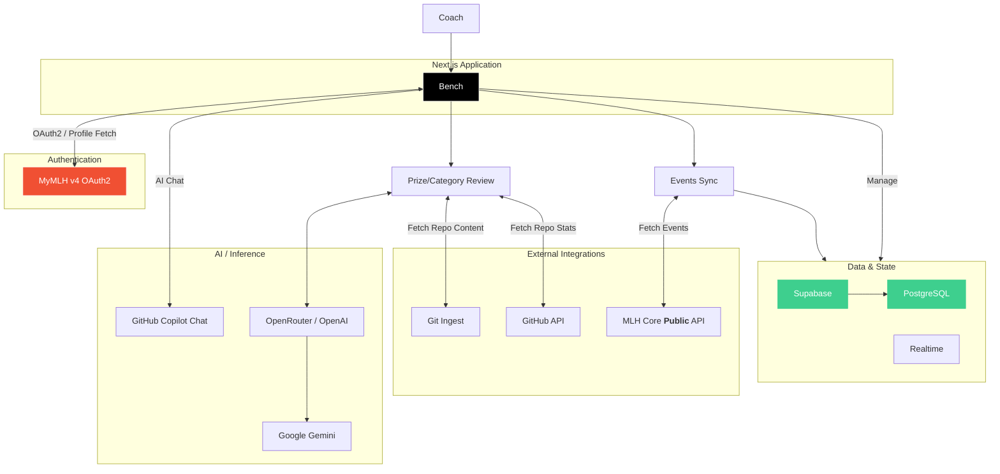

Bench is an AI-assisted judging and verification tool for large hackathons. It pulls events from MLH Core, ingests Devpost CSV exports into Supabase, and runs a multi-agent review over each submission to check GitHub access, hacking timeline, technical complexity, description accuracy, and prize eligibility. Judges get a real-time dashboard to search, filter, score, favorite, and deep-dive into projects.

## What’s inside
- **Next.js 16 app router UI** with favorites, recently viewed projects, filtering/sorting, and a side drawer for per-project details and scoring (`src/components`).
- **MyMLH OAuth** login flow; successful login also triggers an MLH event sync (`src/app/api/auth/*`).
- **Supabase data layer** for events, projects, prize categories, and Realtime updates (`src/lib/supabase/*`, `src/hooks/use-realtime-subscription.ts`).
- **Devpost CSV import** endpoint that normalizes rows, rewrites team headers, and replaces existing projects for an event (`src/app/api/projects/import-csv/route.ts`).
- **AI review pipeline** that:
  - Validates/public GitHub access and ingests code via gitingest.
  - Checks hacking timelines against event dates.
  - Runs a code-review model for tech stack, complexity, and description accuracy.
  - Reviews opted-in prize tracks with grep + LLM scoring.
  - Updates project status and prize results in Supabase (`src/lib/review/*`).
- **MLH Core event sync** helper to seed events with optional filters (`src/lib/mlh-core`).
- Product notes and schema sketches in `docs/PRD.md` and `docs/DB_SCHEMA.md`.

## Architecture



## Quickstart

1) Install deps
```bash
pnpm install
```

2) Configure environment (`.env.local`)
```
# Supabase
NEXT_PUBLIC_SUPABASE_URL=...
NEXT_PUBLIC_SUPABASE_PUBLISHABLE_KEY=...   # anon/public key that can read/write per your RLS

# Auth (MyMLH OAuth)
MY_MLH_CLIENT_ID=...
MY_MLH_CLIENT_SECRET=...
# Optional override for callback host (falls back to NEXT_PUBLIC_VERCEL_URL or localhost)
NEXT_PUBLIC_APP_URL=http://localhost:3000

# MLH Core API (event sync)
MLH_API_URL=https://api.mlh.com
MLH_CORE_PROD_API=...

# GitHub
GITHUB_TOKEN=...   # bot token for Octokit and repo metadata calls

# AI providers
OPENROUTER_API_KEY=...   # used by OpenRouter provider in code review/prize agents
DO_AI_API_KEY=...        # optional: DigitalOcean model key if you switch models
DO_AI_MODEL=openai-gpt-oss-120b
DO_AI_BASE_URL=https://inference.do-ai.run/v1
```

3) Run the app
```bash
pnpm dev
```
Visit `http://localhost:3000/login` and sign in with MyMLH.

## Core workflows

- **Sign in**: `/api/auth/login` → MyMLH → `/api/auth/callback` sets a signed cookie session (`src/lib/auth/session.ts`) and kicks off an MLH event sync.
- **Browse events**: `/events` lists active/past events with search, “My Events” filter (matches staff email), and a sync button for MLH Core (`src/components/events/events-page.tsx`).
- **Import projects**: From an event, open “Import Projects” and upload the Devpost submissions CSV. The import endpoint rewrites team member headers, validates required columns, deletes existing projects for the event, and bulk inserts cleaned rows with inferred GitHub links and prize opt-ins.
- **Run analysis**: Click “Run” on a project or “Process all / Re-run failed” in the table toolbar. This posts to `/api/projects/start-review`, which:
  1) Marks the project processing and seeds pending prize results.
  2) Validates GitHub accessibility and fetches repository content.
  3) Checks commit timelines against event dates.
  4) Runs LLM code review (tech stack, complexity, description accuracy).
  5) Runs prize-track agents for each opted-in category.
  6) Marks status `processed` or an error/invalid state. Realtime keeps the UI in sync.
- **Judge & triage**: In the dashboard, filter by status/complexity/prize track/tech stack, star favorites, take notes, and assign numeric scores. Detailed sheets show code review summaries, prize explanations, and a Copilot prompt helper for live judging.

## Scripts
- `pnpm dev` – run Next.js dev server.
- `pnpm build` / `pnpm start` – production build & serve.
- `pnpm lint` – Biome lint with auto-fix where safe.
- `pnpm format` – Biome formatter.
- `pnpm type-check` – TypeScript type check.
- `pnpm check` – lint + format + type-check.
- `pnpm gen-types` – regenerate `src/database.types.ts` from Supabase (project id is pinned in the script).

## Notes & tips
- Supabase RLS must permit the anon key to read/write the `events`, `projects`, and `prize_categories` tables used by the API routes, or replace the publishable key with a service role key in server calls.
- The MLH event sync defaults to physical hackathons within a rolling window; adjust args in `syncMlhEventsToDb` if you need virtual events or broader ranges.
- The Devpost CSV importer truncates existing projects for the event before inserting; use with care in shared environments.
- Realtime is wired via `useRealtimeSubscription`; if you disable Realtime in Supabase, fall back to manual refetches.
- AI calls rely on OpenRouter by default; ensure quotas are available or swap the model/provider in `src/lib/review/agents/3-code-review.ts` and `4-prize-category-review.ts`.
